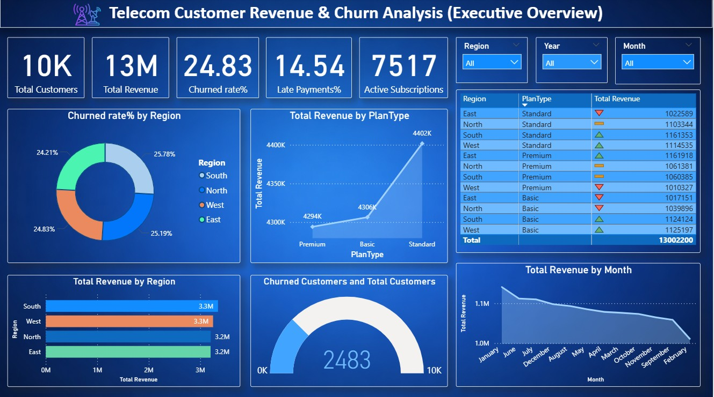
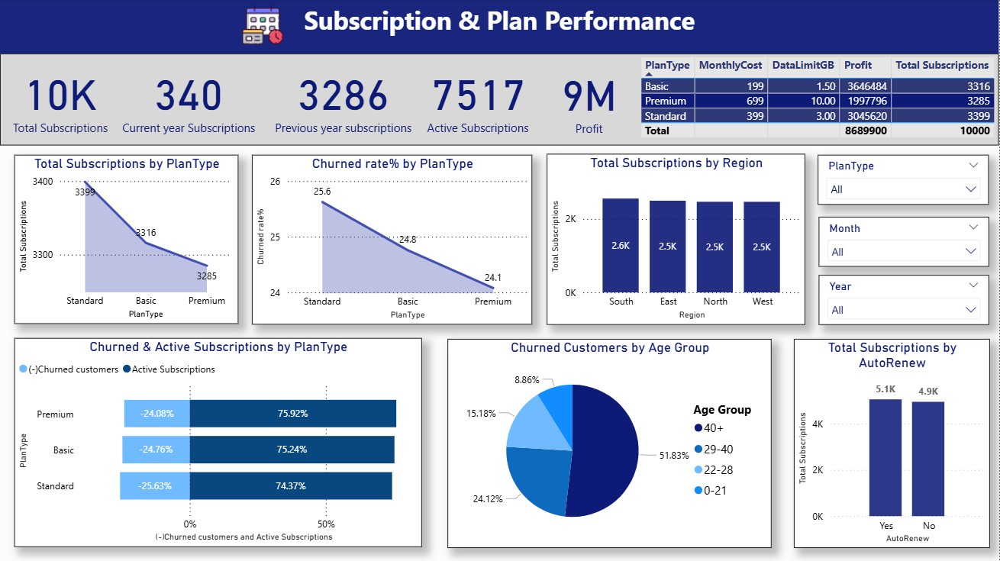
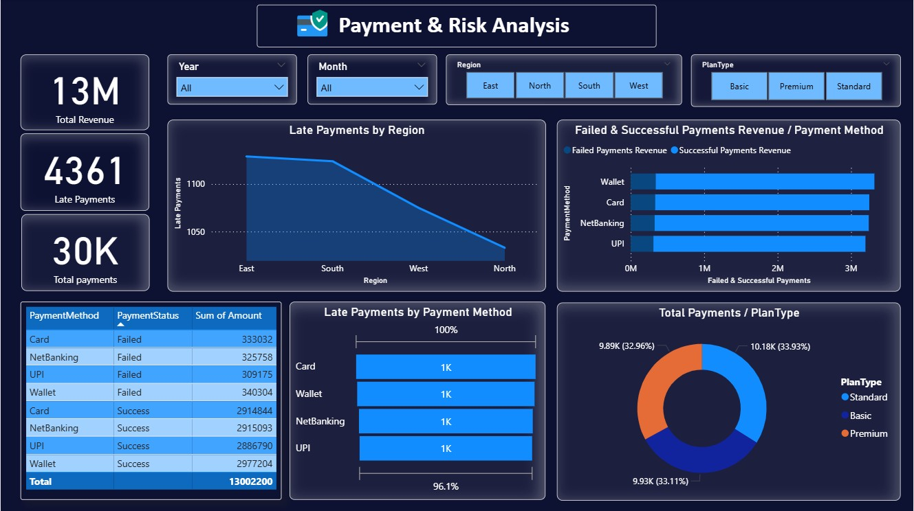

## Telecom Customer Churn, Revenue & Payment Behaviour Analysis
## **Dashboard-1**

## **Dashboard-2**

## **Dashboard-3**

### **Project Objective**
The objective of this project is to analyze customer churn behaviour, revenue generation, payment trends, and plan performance using telecom subscription data. 
This project aims to : 
•	Measure churn rate 
•	Analyze payment delays 
•	Determine most profitable plans 
•	Provide business-driven recommendations 
•	Understand revenue distribution 
•	Compare active vs churned customers 
•	Provide actionable business insights 

### **Tools & Technologies Used**
•	Python (Pandas, NumPy) 
•	Power BI (DAX, Data Modeling,KPI) 
•	Jupyter Notebook 
### **Project architecture**
Python (Cleaning & Feature Engineering) 
↓ 
CSV Export 
↓ 
Power BI Data Modeling 
↓ 
DAX Calculations 
↓ 
Interactive Dashboards 
↓ 
Business Insights 

### **Data Collection**
Used 4 datasets : 
Customers (10,000 records) 
Payments (30,000 records) 
Subscriptions (10,000 records) 
Plans (3 records)

### **Data Cleaning & Preprocessing (Python – Pandas)**
Performed data cleaning using Jupyter Notebook : 
Removed duplicate records 
Handled missing values 
Fixed inconsistent text (e.g., gender, region) 
Converted incorrect data types (dates, age) 
Standardized categorical values 
Replaced invalid values with mean/appropriate values

### **Feature Engineering**
Created meaningful fields like : 
Age groups 
Late payment flags 
Customer segmentation improvements

### **Data Modeling (Power BI)**
Built relational model : 
Customers → Subscriptions 
Customers → Payments 
Plans → Subscriptions 
Created Date Tables for time-based analysis

### **DAX Calculations**
Developed key business metrics : 
Churn Rate 
Total Revenue 
Failed Payments Revenue 
Late Payment % 
Active vs Churned Customers 
Profit Calculation

### **Dashboard Development (Power BI)**
Created 3 interactive dashboards : 
Executive overview 
Subscription & Plan Performance 
Payment & Risk Analysis
### **Project impact :**
This project enables telecom management to : 
•	Reduce churn 
•	Reduce revenue leakage 
•	Increase customer retention 
•	Adjust pricing strategy 
•	Increase profitability 
•	Launch region-specific campaigns 
•	Focus expansion in high-performing regions 
•	Identify which payment mode causes higher failures

### **Conclusion**
Built an end-to-end analytics pipeline 
Used Python for data cleaning & transformation 
Used Power BI for modeling, DAX, and visualization 
Delivered actionable insights for telecom business improvement

